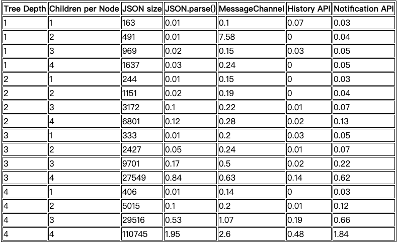

## 深拷贝浅谈

### 概述

  在 Javascript 中，引用类型的值（如 Array, Object etc.）的拷贝，只是拷贝它们在内存中的地址，修改其中一个的属性，另一个也会同样更改。在业务逻辑中，对数据处理往往会引起问题。

  ```javascript
  const a = { name: 'a', age: 10 };
  const b = a;

  b.name = 'b';
  console.log(a) // { name: 'b', age: 10 }
  console.log(b) // { name: 'b', age: 10 }
  ```

  提示 Array 的原型方法 slice, concat 和 Object.assign 以及展开操作符，执行的都是浅拷贝(shallow copy 只遍历一层)

### 处理方式

* **工具库提供的 deepCopy**

  一些流行的工具库提供了深拷贝的方法，如 jQuery 的 $.extend（循环引用有问题） 和 Lo-dash 的 _.cloneDeep, 也或者自己实现一个类似的方法。


* **JSON序列化与反序列化**

  通过 JSON.parse(JSON.stringify(obj)) 的形式最简单快捷，但是对于 undefined, null, NaN, Reg, Function 会自动忽略，如果只是纯数据的情况下，使用此方法最便捷，性能问题有待考虑。

* **[结构化克隆算法](https://developer.mozilla.org/zh-CN/docs/Web/Guide/API/DOM/The_structured_clone_algorithm)**

  注意： Error, Function, Dom 不能被复制，抛出异常, 某些对象的特定参数不被保留, 支持的类型详见 [MDN 结构化克隆算法](https://developer.mozilla.org/zh-CN/docs/Web/Guide/API/DOM/The_structured_clone_algorithm)

  1. pushState/replaceState
  
  避免影响 history, 建议使用 replaceState, 如果传了一个序列化后大于640k的状态对象，该方法会抛出异常，safari 也会对调用次数做出限制，30s 最多 100 次。

  ```javascript
  function deepClone(obj) {
    const oldState = history.state;
    const { title } = document;
    history.replaceState(obj, title);
    const { state } = history;
    history.replaceState(oldState, title);
    return state;
  }
  ```


  1. window.postMessage


  ```javascript
  function deepClone(obj) {
    return new Promise(resolve)
    const {port1, port2} = new ChannelMessage();
    port2.onmessage((ev)=> resolve(ev.data));
    port1.postMessage(obj)
  }
  ```


  1. Web Workers


  1. IndexedDB


测试结果来源 [test-Surma](https://deep-copy.glitch.me/)



引用来源

* [MDN 结构化克隆算法](https://developer.mozilla.org/zh-CN/docs/Web/Guide/API/DOM/The_structured_clone_algorithm)

* [twitter-Surma](https://twitter.com/DasSurma/status/955490070076776448)

* [test-Surma](https://deep-copy.glitch.me/)

* [JavaScript 深拷贝性能分析](https://justjavac.com/javascript/2018/02/02/deep-copy.html)
